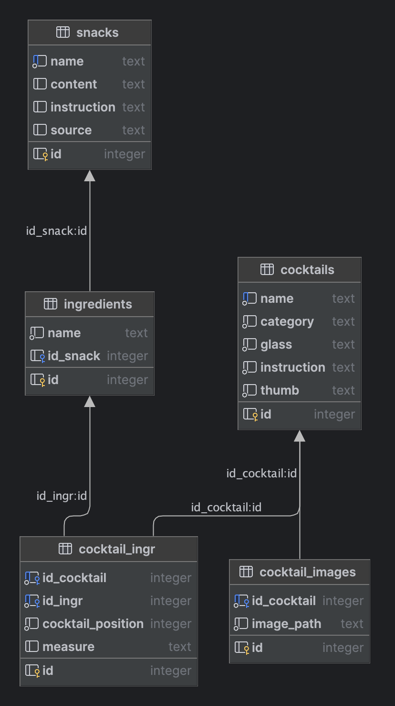

{: .label }
[Tatjana K., Julia K.]

{: .no_toc }
# Data model

{: .text-delta }

Table of contents

+ ToC
{: toc }

[Tatjana K.]

## Cocktails & Snacks

Status
: Work in progress - **Decided** - Obsolete

Dieses Datenmodell dient der strukturierten Speicherung von Informationen zu Cocktails, deren Zutaten, zugehörigen Bildern sowie Snacks und deren Bestandteilen. Es besteht aus sechs zentralen Tabellen und beschreibt die Beziehungen zwischen diesen Entitäten.

### Snack-Table

Beinhaltet Informationen zu Snacks, die zu den Cocktails serviert werden können (ID, Name des Snacks, Zutaten für die Vorbereitung (optional), Rezept (optional), Quelle(optional)).

### Tabelle cocktails

Speichert Informationen zu einzelnen Cocktails (ID, Name des Cocktails, Kategorie(Cocktail, Ordinary Drink, usw), Cocktailglas, Rezept, URL-Link des originalen Thumbnail/Vorschaubild).

### Tabelle cocktail_ingr

Verbindet Cocktails mit ihren Zutaten (Many-to-Many-Beziehung), ergänzt um Detailinformationen (Cocktail-ID, Zutaten-ID, Position einer Zutat im Cocktail, Menge der Zutat im Cocktail). 

### Tabelle ingredients

Enthält eindeutige (unique) Zutaten, die für Cocktails verwendet werden.

### Tabelle cocktail_images

Speichert den Pfad zu den Cocktail-Images auf dem lokalen Dateisystem.

### Beziehungen im Modell

1) Ein Cocktail kann mehrere Zutaten haben (cocktail -> cocktail_ingr).
2) Jede Zutat kann mehreren Cocktails zugeordnet sein (ingredients -> cocktail_ingr).
3) Ein Cocktail kann nur ein Bild besitzen (cocktail -> cocktail_images).
4) Jeder Snack wird zu **einer** Zutat zugeordnet können (ingredients -> snacks).

[Julia K.]

## User & Likes

Status
: Work in progress - **Decided** - Obsolete

Dieses Datenmodell dient der Speicherung von Informationen zu den Nutzern der Plattform. Es ermöglicht die Verwaltung von Benutzerprofilen und deren Likes auf der Website.

### Tabelle users

Beinhaltet Informationen zu den Nutzern: ID, E-Mail-Adresse, Passwort-Hash. 

### Tabelle cocktail_likes

Speichert die Beziehung zwischen Nutzern und den Cocktails, die sie mit einem Like markiert habe (user_id, cocktail_id). Dies ermöglicht angemeldeten Nutzern diese Cocktails wiederzufinden. 
