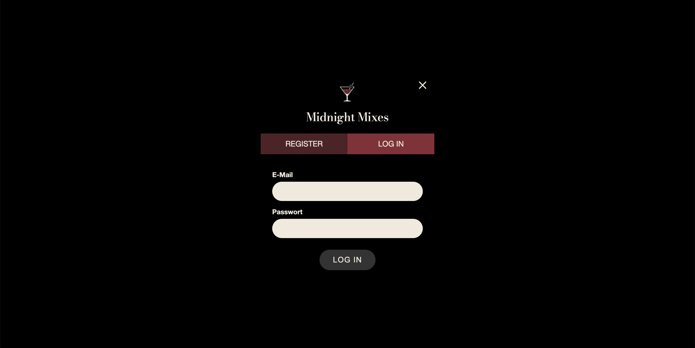
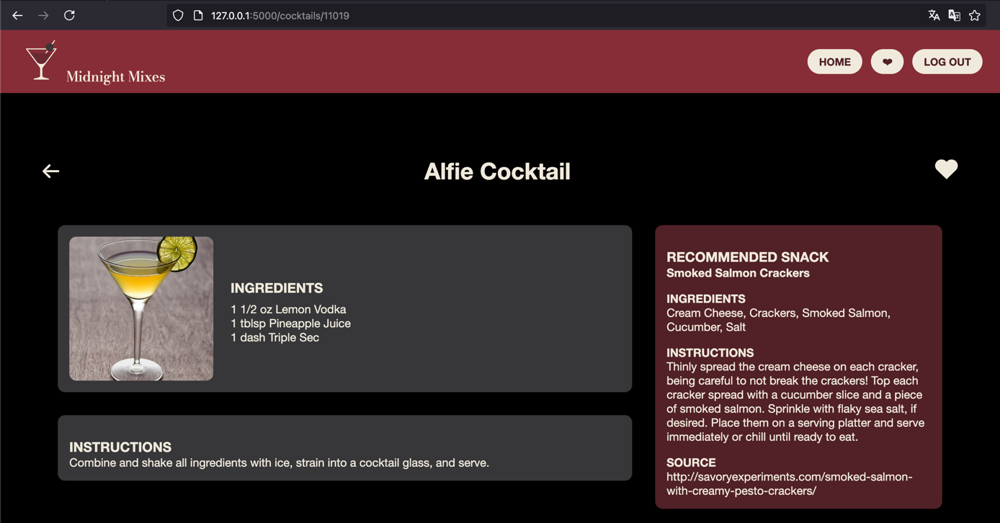
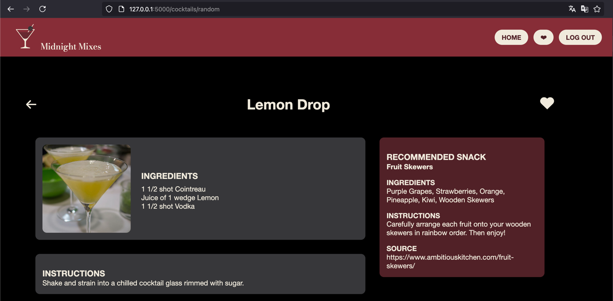
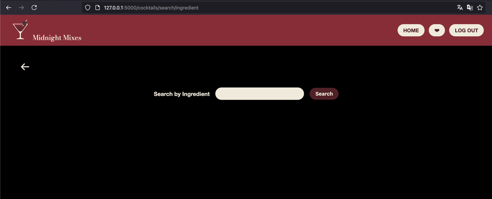
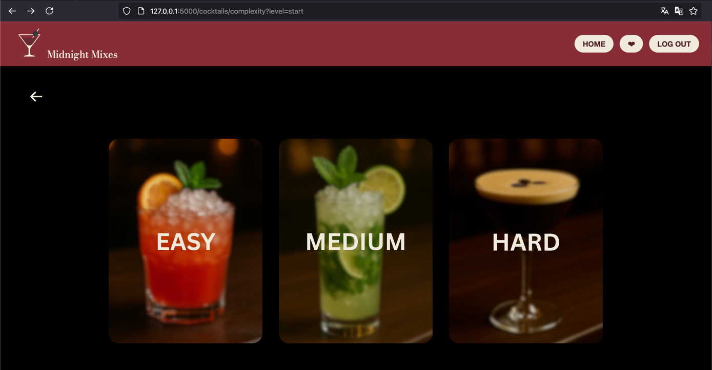
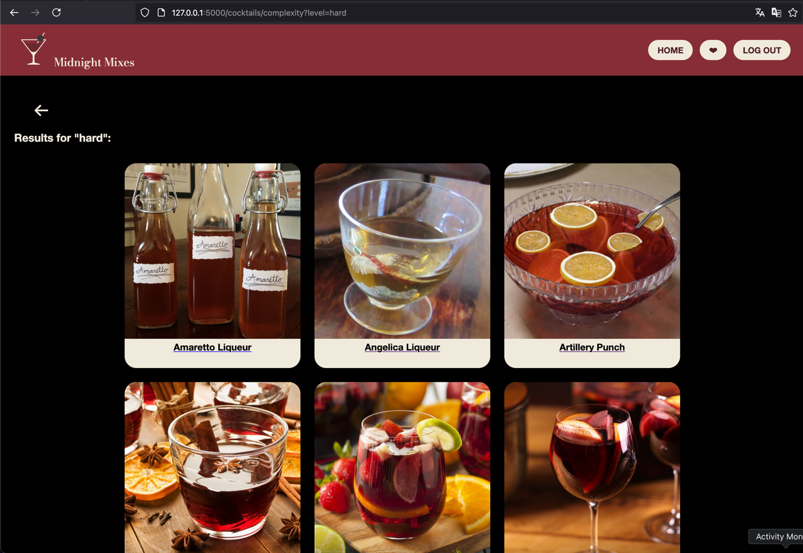
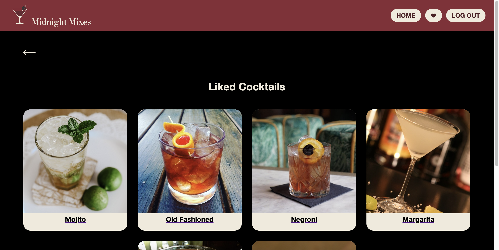

{: .label }
[Jane Dane]

{: .no_toc }
# Reference documentation

{: .text-delta }

Table of contents

+ ToC
{: toc }

---

## Auth / User Management

### register()

**Route:** `/register`

**Methods:** `POST` `GET`

**Purpose:** Ermöglicht neuen Nutzern die Konto­erstellung.

Bei GET wird das Registrierungsformular angezeigt.

Bei POST wird überprüft, ob die E-Mail bereits in der DB existiert. Wenn nicht, wird das Passwort gehasht und der neue Nutzer angelegt.

**Sample output:**

---

### login()

**Route:** `/login`

**Methods:** `POST` `GET`

**Purpose:** Ermöglicht es Nutzern, die einen Account haben, sich einzuloggen.

Bei GET wird das Login-Formular angezeigt.

Bei POST werden E-Mail und Passwort validiert: Existiert der Nutzer nicht oder ist das Passwort falsch, wird eine Fehlermeldung angezeigt und zurück zum Login geleitet. Bei erfolgreicher Authentifizierung wird die Nutzer-Session gesetzt und zur Startseite weitergeleitet.

**Sample output:**

---

### logout()

**Route:** `/logout>`

**Methods:** `GET`

**Purpose:** Führt den Benutzer-Logout durch, indem die Session-Daten gelöscht werden, eine Info-Nachricht angezeigt wird und der Nutzer zur Startseite weitergeleitet wird.

**Sample output:**

Flash-Message: "Logged out"

## Cocktail Page

### `get_cocktail(cocktail_id_arg)`

**Route:** `/cocktails/<cocktail_id_arg>`

**Methods:** `GET`

**Purpose:**  
Gibt ein Page mit einem einzigen Cocktail mit einer ID.  
Ebenso `<cocktail_id_arg>` kann den Wert `random` annehmen und damit einen Random-Cocktail zeigen.

**Sample output:**

---

## Search Filters

### `search_ingr()`

**Route:** `/cocktails/search/ingredient`

**Methods:** `GET`, `POST`

**Purpose:**   
Suche nach einem Cocktails-Ingredient.

**Sample output:**

---

### `complexity()`

**Route:** `/cocktails/complexity`

**Methods:** `GET`

**Purpose:** Zeigt eine Menü-Page für die Schwirigkeitsgrade (Complexity Levels) 

**Sample output:**

## Likes

### like_cocktail(cocktail_id)

**Route:** `/cocktails/<int:cocktail_id>/like`

**Methods:** `POST`

**Purpose:** Ermöglicht eingeloggten Nutzern, einen Cocktail zu „liken“ oder den Like wieder zu entfernen.

Prüft, ob der Nutzer in der Session ist. Andernfalls wird er zur Login-Seite weitergeleitet.

War noch kein Like gesetzt, wird ein neuer Eintrag in der Tabelle cocktail_likes angelegt. Existiert bereits ein Like, wird dieser gelöscht. 

**Sample output:**

---

### my_likes()

**Route:** `/my-likes`

**Methods:** `GET`

**Purpose:** Zeigt eingeloggten Nutzern alle Cocktails, die sie geliked haben.

Prüft hier auch erstmal, ob der Nutzer angemeldet ist. Wenn nicht wird er weitergeleitet zum Login.

Führt eine DB Abfrage auf cocktail_likes, cocktails und optional cocktail_images aus, um ID, Namen und Bildpfad der gelikten Cocktails zu laden.

Das Ergebnis wird in eine Dictionary und über das Template likes.html angezeigt. 

**Sample output:**

