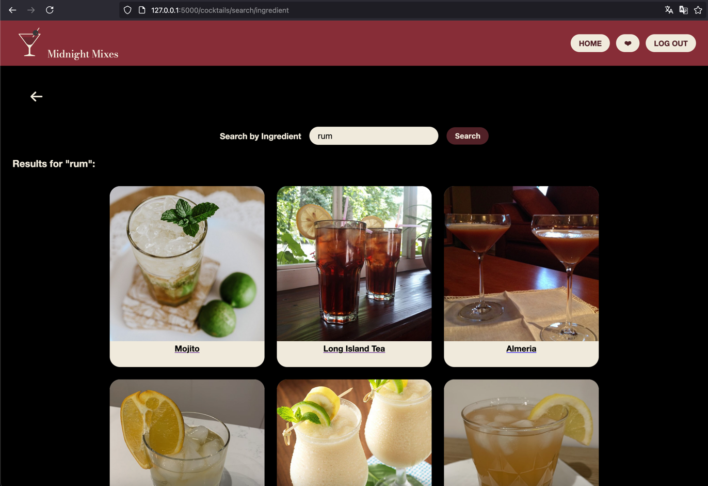

{: .label }
[Jane Dane]

{: .no_toc }
# Reference documentation

{: .text-delta }

Table of contents

+ ToC
{: toc }

## [Section / module]

### `function_definition()`

**Route:** `/route/`

**Methods:** `POST` `GET` `PATCH` `PUT` `DELETE`

**Purpose:** [Short explanation of what the function does and why]

**Sample output:**

[Show an image, string output, or similar illustration -- or write NONE if function generates no output]

---

### `get_cocktail(cocktail_id_arg)`

**Route:** `/cocktails/<cocktail_id_arg>`

**Methods:** `GET`

**Purpose:**  
Gibt ein Page mit einem einzigen Cocktail mit einer ID.  
Ebenso `<cocktail_id_arg>` kann den Wert `random` annehmen und damit einen Random-Cocktail zeigen.

**Sample output:**

---

### `search_ingr()`

**Route:** `/cocktails/search/ingredient`

**Methods:** `GET`, `POST`

**Purpose:**   
Suche nach einem Cocktails-Ingredient.

**Sample output:**

---

## [Example, delete this section] Insert sample data

### `complexity()`

**Route:** `/cocktails/complexity`

**Methods:** `GET`

**Purpose:** Zeigt eine Menü-Page für die Schwirigkeitsgrade (Complexity Levels) 

**Sample output:**

